<!-- ╔══════════════════════════════════════════════════════════════╗ -->
<!-- ║         MUHAMMAD USMAN — usman11267.github.io               ║ -->
<!-- ║   AI Engineer · Full Stack Developer · CS @ Air University  ║ -->
<!-- ╚══════════════════════════════════════════════════════════════╝ -->

<div align="center">

<!-- ─────────────────────────────────────────── -->
<!--                HERO BANNER                  -->
<!-- ─────────────────────────────────────────── -->

<picture>
  <source media="(prefers-color-scheme: dark)" srcset="./assets/svg/banner.svg">
  <source media="(prefers-color-scheme: light)" srcset="./assets/svg/banner.svg">
  
</picture>

<br/>

<!-- ─────────────────────────────────────────── -->
<!--            ANIMATED TYPING LINE             -->
<!-- ─────────────────────────────────────────── -->


<br/><br/>

<!-- ─────────────────────────────────────────── -->
<!--               SOCIAL LINKS                  -->
<!-- ─────────────────────────────────────────── -->

[](https://linkedin.com/in/usman11267)
[](mailto:waseerusman2@gmail.com)
[](https://openclip.lovable.app)
[](https://github.com/usman11267)
&nbsp;&nbsp;


</div>


<!-- ╔════════════════════════════════════════╗ -->
<!-- ║               $ whoami                 ║ -->
<!-- ╚════════════════════════════════════════╝ -->

## `$ whoami`

```typescript
const usman: Profile = {
  name:       "Muhammad Usman",
  location:   "Islamabad, Pakistan 🇵🇰",
  university: "Air University — BSCS 2022–2026",
  role:       "AI Engineer · Full Stack Developer",
  exp:        "AI Engineer Intern @ Zamus Pvt Ltd  (May–Aug 2025)",

  building: {
    "HealthVerse": "AI-powered eye care platform  — FYP 2026",
    "OpenClip":    "AI SaaS for short-form video generation",
  },

  stack: {
    ai:       ["LangGraph", "LangChain", "RAG", "LoRA/Unsloth", "Qdrant", "Gemini"],
    backend:  ["FastAPI", "ASP.NET Core (.NET 8)", "Node.js / Express"],
    frontend: ["React", "Next.js", "Flutter", "TanStack Start"],
    cloud:    ["Azure", "Supabase", "Firebase", "MongoDB", "Docker"],
    tools:    ["n8n", "Git", "Postman", "GitHub Actions"],
  },

  openTo:  ["AI Engineer roles", "open-source collaboration", "LLM consulting"],
  funFact: "I solve the hardest bugs during my 5–10k step morning walks 🚶",
};
```


<!-- ╔════════════════════════════════════════╗ -->
<!-- ║              EXPERIENCE                ║ -->
<!-- ╚════════════════════════════════════════╝ -->

## Experience

<table width="100%">
<tr>
<td width="120" valign="top" align="center">
<br/>

<br/>

</td>
<td valign="top">
<br/>

**AI Engineer Intern — Zamus Pvt Ltd, Islamabad**
`May 2025 – Aug 2025`

- Fine-tuned and deployed LLMs & deep learning models, improving prediction accuracy via advanced preprocessing and feature engineering pipelines
- Architected scalable ML inference pipelines using Python, TensorFlow & PyTorch for production workloads
- Collaborated with cross-functional teams to reduce model latency through optimized batched data ingestion

</td>
</tr>
<tr>
<td width="120" valign="top" align="center">
<br/>

<br/>

</td>
<td valign="top">
<br/>

**Computer Science — Air University, Islamabad**
`2022 – 2026`

- Specialization in AI, machine learning, and full-stack software engineering
- Completed AUCIS certifications in Flutter Mobile Development & Full-Stack Web Development
- Final Year Project: HealthVerse — presented at AU FYP Open House 2026 🏆

</td>
</tr>
</table>


<!-- ╔════════════════════════════════════════╗ -->
<!-- ║           FEATURED PROJECTS            ║ -->
<!-- ╚════════════════════════════════════════╝ -->

## Featured Projects

<br/>

<!-- ┌─────────────────────────────────────────┐ -->
<!-- │  1. HEALTHVERSE                         │ -->
<!-- └─────────────────────────────────────────┘ -->

<table width="100%">
<tr>
<td width="50%" valign="top">

### HealthVerse &nbsp; `FYP 2026`
> End-to-end AI healthcare system — mobile app, doctor dashboard, intelligent AI agents & medical RAG pipeline. Presented at **AU FYP Open House 2026**.

**Architecture**

| Layer | Technology |
|:------|:-----------|
| Mobile App | Flutter (patient & doctor) |
| Web Dashboard | React · ASP.NET Core |
| Backend APIs | FastAPI · .NET 8 |
| AI Vision | CNN · EfficientNet-B7 · ResNet-50 |
| LLM Stack | LoRA + Unsloth · LangGraph Agents |
| Vector Store | Qdrant · Gemini Embeddings |
| Infra | Azure · MongoDB · n8n |

</td>
<td width="50%" valign="top">

<br/><br/>

**Key Capabilities**

```
🧠  Medical RAG pipeline — LLM grounded on ophthalmic literature
🤖  Multi-agent system — LangGraph diagnosis & triage agents
👁️  AI Vision — retinal disease classification (CNNs)
📡  Telemedicine — real-time doctor-patient consultation
⚙️  Automation — n8n workflows for reminders & reports
```

<br/>


<br/>

[](https://github.com/usman11267)

</td>
</tr>
</table>

---

<!-- ┌─────────────────────────────────────────┐ -->
<!-- │  2. OPENCLIP                            │ -->
<!-- └─────────────────────────────────────────┘ -->

<table width="100%">
<tr>
<td width="50%" valign="top">

### OpenClip &nbsp; `In Development`
> AI SaaS — auto-generates TikTok / Reels / Shorts from long-form videos.
> **[openclip.lovable.app](https://openclip.lovable.app)**

**Roadmap**

```diff
+ Google OAuth + Supabase auth flow
+ Projects & credits DB schema (RLS)
+ Animated AI processing UI
- Real AI clipping pipeline (in progress)
- Stripe subscription + credit system
- Multi-format export (TikTok, Reels, Shorts)
```

</td>
<td width="50%" valign="top">

<br/><br/>

**Stack**


<br/>


</td>
</tr>
</table>

---

<!-- ┌─────────────────────────────────────────┐ -->
<!-- │  3. NUTRICARE                           │ -->
<!-- └─────────────────────────────────────────┘ -->

<table width="100%">
<tr>
<td width="50%" valign="top">

### NutriCare
> Full-stack AI nutrition platform — BMI tracking, diet logging, appointment booking & real-time patient-dietitian chat powered by Google Gemini.

- Personalized nutrition guidance via **Google Gemini AI**
- Real-time patient–dietitian chat via **Firebase Realtime DB**
- Recharts-powered analytics for dietitian dashboards
- Appointment scheduling with calendar sync

</td>
<td width="50%" valign="top">

<br/><br/>

**Stack**


</td>
</tr>
</table>

<br/>

<!-- ┌─────────────────────────────────────────┐ -->
<!-- │  OTHER PROJECTS (collapsible)           │ -->
<!-- └─────────────────────────────────────────┘ -->

<details>
<summary>&nbsp;<b>Other Projects</b> — click to expand</summary>
<br/>

| Project | Description | Stack |
|:--------|:------------|:------|
| **WhatsApp Expense Tracker** | Message → AI extracts amount+category → Google Sheets. Fully serverless. | n8n · Groq LLM · Twilio · Google Sheets |
| **Telegram AI Health Coach** | Multi-user bot: tracks meals, gives AI nutrition advice, logs per-user data. | n8n · Supabase · Groq · LogMeal API |
| **Salon Management System** | Full-stack platform: appointments, customer management, admin dashboard. | React · Node.js · Express · MongoDB |
| **Real-Time Heart Rate Monitor** | Detects heart rate from webcam via rPPG + facial landmarks. No hardware. | PyQt5 · OpenCV · Mediapipe |

</details>


<!-- ╔════════════════════════════════════════╗ -->
<!-- ║              TECH STACK                ║ -->
<!-- ╚════════════════════════════════════════╝ -->

## Tech Stack

<div align="center">

#### Languages


#### AI / ML


#### Frontend & Mobile


#### Backend & APIs


#### Cloud & Databases


#### Tools & Automation


</div>


<!-- ╔════════════════════════════════════════╗ -->
<!-- ║             GITHUB STATS               ║ -->
<!-- ╚════════════════════════════════════════╝ -->

## GitHub Stats

<div align="center">


&nbsp;


<br/><br/>


<br/><br/>


<br/><br/>


</div>


<!-- ╔════════════════════════════════════════╗ -->
<!-- ║         CONTRIBUTION SNAKE             ║ -->
<!-- ╚════════════════════════════════════════╝ -->

## Contribution Graph

<div align="center">

<picture>
  <source media="(prefers-color-scheme: dark)"  srcset="https://raw.githubusercontent.com/usman11267/usman11267/output/github-snake-dark.svg"/>
  <source media="(prefers-color-scheme: light)" srcset="https://raw.githubusercontent.com/usman11267/usman11267/output/github-snake.svg"/>
  
</picture>

</div>


<!-- ╔════════════════════════════════════════╗ -->
<!-- ║            CERTIFICATIONS              ║ -->
<!-- ╚════════════════════════════════════════╝ -->

## Certifications

<div align="center">

<table width="92%">
<tr>
<td align="center" width="33%">

**Flutter Mobile Dev**
<br/>*AUCIS — Air University*
<br/><br/>


<br/>
`MVVM · Google Play Console`

</td>
<td align="center" width="33%">

**Full Stack Web Dev**
<br/>*AUCIS — Air University*
<br/><br/>


<br/>
`MongoDB · Supabase · Tailwind`

</td>
<td align="center" width="33%">

**AU FYP Open House 2026**
<br/>*Air University*
<br/><br/>
[](https://github.com/usman11267)
<br/><br/>
`AI Eye Care Platform`

</td>
</tr>
</table>

</div>


<!-- ╔════════════════════════════════════════╗ -->
<!-- ║          CURRENT FOCUS                 ║ -->
<!-- ╚════════════════════════════════════════╝ -->

## Now

<table width="100%">
<tr>
<td width="25%" valign="top">

**Building**
```
→ HealthVerse FYP
→ OpenClip AI SaaS
→ LangGraph agents
```

</td>
<td width="25%" valign="top">

**Learning**
```
→ LLM fine-tuning
→ Azure AKS + Cosmos
→ Agent orchestration
```

</td>
<td width="25%" valign="top">

**2026 Goals**
```
→ Ship HealthVerse
→ 100+ OpenClip users
→ AI Engineer role
```

</td>
<td width="25%" valign="top">

**Open Source**
```
→ LangGraph templates
→ RAG utility libs
→ LLM docs & guides
```

</td>
</tr>
</table>


<!-- ╔════════════════════════════════════════╗ -->
<!-- ║               CONTACT                  ║ -->
<!-- ╚════════════════════════════════════════╝ -->

## Contact

<div align="center">

<table>
<tr>
<td align="center">

[](https://linkedin.com/in/usman11267)

</td>
<td align="center">

[](mailto:waseerusman2@gmail.com)

</td>
<td align="center">

[](https://openclip.lovable.app)

</td>
</tr>
</table>

<br/>

```
"Build things that matter. Ship before perfect. Learn by doing."
```

<br/>


</div>
